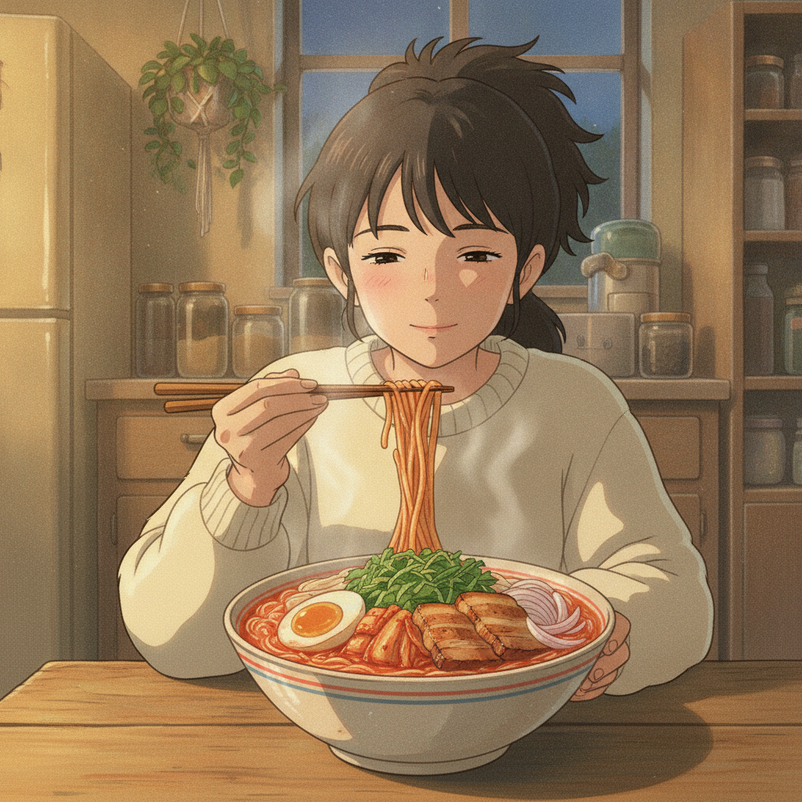

# 삼겹 김치 쌀국수 (15분)

> 냄비 하나로 끝나는 야식. 냉장고에 있는 삼겹살 세 줄과 김치면 국물까지 나온다.

- **소요 시간** 15분
- **분량** 1인분
- **난이도** 쉬움

## 재료

- 쌀국수 100g — 마른 면 그대로 (미리 불릴 필요 없음)
- 삼겹살 100g — 한 입 크기로 썰기 (3~4줄)
- 김치 1컵 — 잘 익은 것으로, 2cm 폭으로 썰기
- 김치 국물 2큰술 — 국물 간의 핵심이라 꼭 챙길 것
- 양파 1/4개 — 굵게 채 썰기
- 마늘 2쪽 — 편으로 썰기
- 달걀 1개 — 반숙으로 삶거나 프라이
- 깻잎 3장 — 돌돌 말아 채 썰기
- 물 500ml
- (선택) 상추 2장 — 깻잎 대신 올려도 된다

### 국물 간

| 재료 | 분량 |
|---|---|
| 김치 국물 | 2큰술 |
| 고춧가루 | 1작은술 |
| 소금 | 1/3작은술 |
| 참기름 | 1작은술 (마무리) |
| 깨소금 | 1/2작은술 (마무리) |

## 만드는 법

1. **재료 손질 (2분)**
   양파와 마늘을 썰고, 김치는 2cm 폭으로, 삼겹살은 한 입 크기로 썬다. 깻잎은 마지막에 올릴 것이니 채 썰어 따로 둔다.

2. **삼겹살 굽기 (4분)**
   기름 없이 달군 냄비에 삼겹살을 넣고 센 불에서 겉이 노릇해질 때까지 굽는다. 나온 기름은 버리지 말고 그대로 둔다.
   *삼겹살 기름이 이 국물의 육수 역할을 한다. 따로 육수를 낼 시간을 여기서 번다.*

3. **김치·양파 볶기 (3분)**
   같은 냄비에 김치, 양파, 마늘을 넣고 중불에서 볶는다. 김치 가장자리가 투명해지고 신 냄새가 고소하게 바뀌면 된다.
   *김치를 물에 바로 넣으면 신맛만 남는다. 기름에 먼저 볶아야 단맛이 올라온다.*

4. **국물 끓이기 (3분)**
   물 500ml, 김치 국물 2큰술, 고춧가루 1작은술을 넣고 센 불로 끓인다. 끓어오르면 소금으로 간을 맞춘다.

5. **면 삶기 (2분)**
   끓는 국물에 마른 쌀국수를 그대로 넣고 2분간 삶는다. 젓가락으로 한 번 풀어준다.
   *쌀국수는 불에서 내린 뒤에도 국물 열로 계속 익는다. 살짝 덜 익었다 싶을 때 불을 끄는 게 맞다.*

6. **담기 (1분)**
   그릇에 옮기고 반숙 달걀을 반으로 갈라 올린다. 채 썬 깻잎을 얹고 참기름 1작은술, 깨소금 1/2작은술을 뿌린다.

## 곁들이면 좋은 것

- **치즈 1장** — 면 위에 올려 국물 열로 녹이면 매운맛이 눌리고 부드러워진다.
- **사과 몇 조각** — 느끼함을 끊어줘서 야식 뒤 입이 개운하다.
- **만두 2~3개** — 4번 단계에서 국물에 같이 넣으면 한 그릇이 든든해진다.

## 팁

- **대체 재료** — 쌀국수가 없으면 소면(국수)으로. 대신 밀가루 면은 국물이 탁해지니 따로 삶아 헹군 뒤 넣는다. 삼겹살 대신 프랭크소세지를 어슷 썰어 써도 된다.
- **맛 조절** — 너무 시면 물을 50ml 더 넣고 소금으로 다시 잡는다. 반대로 밍밍하면 김치 국물을 1큰술씩 더한다. 고춧가루는 처음부터 다 넣지 말고 마지막에 맛을 보며 더하는 게 안전하다.
- **밤에 부담될 때** — 삼겹살을 50g으로 줄이고 물을 600ml로 늘리면 훨씬 가벼워진다.
- **면이 불었다면** — 다음 날 남은 국물은 면을 건져내고 밥을 말아 먹는 쪽이 낫다. 쌀국수는 재가열하면 끊어진다.
