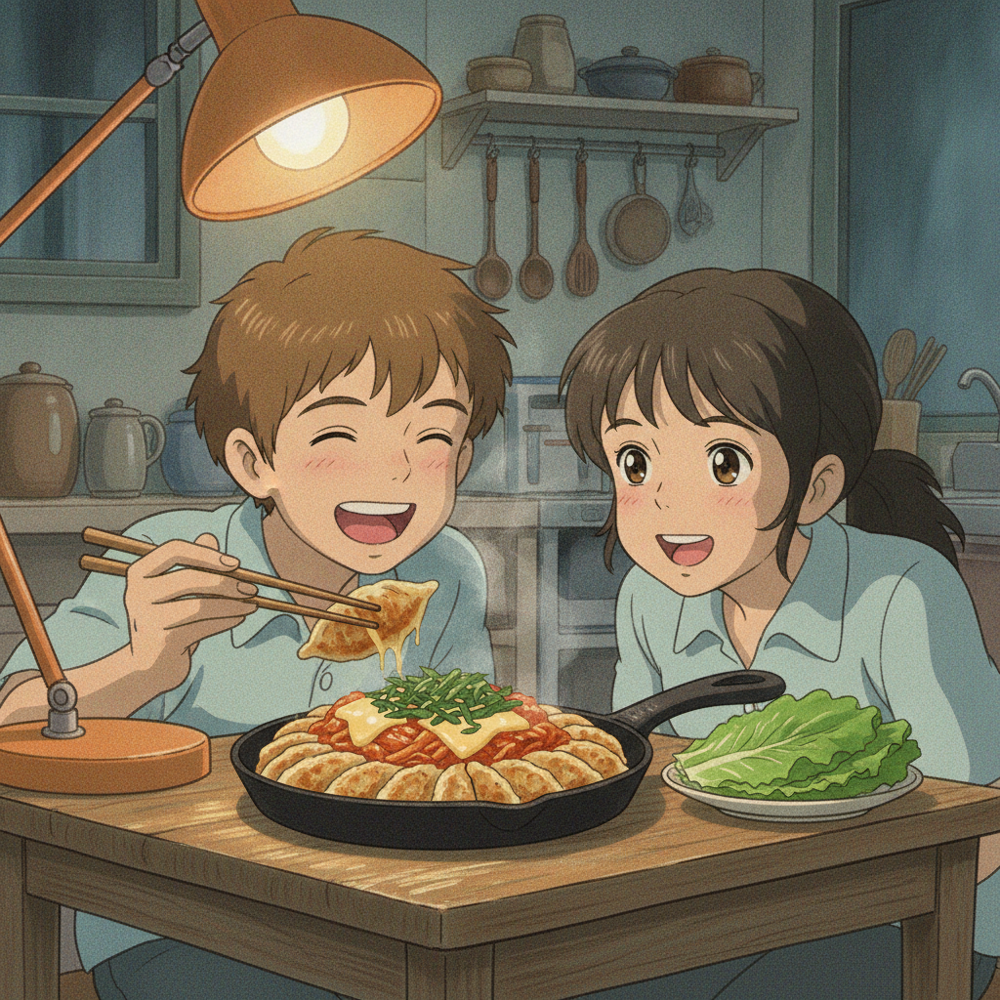

# 치즈 김치 군만두 (10분)

> 팬 하나, 기름 한 방울 없이. 둘이서 맥주 한 캔씩 놓고 집어 먹기 좋은 야식.

- **소요 시간** 10분
- **분량** 2인분
- **난이도** 쉬움

## 재료

- 만두 10개 — 냉동 그대로, 해동하지 말 것
- 김치 1컵 — 잘 익은 것으로, 잘게 썰기
- 양파 1/4개 — 잘게 다지기
- 치즈 2장 — 반으로 잘라 두기
- 깻잎 4장 — 돌돌 말아 채 썰기
- 물 4큰술 — 만두 찔 때
- (선택) 상추 4장 — 쌈으로 싸 먹을 것

### 김치 양념

| 재료 | 분량 |
|---|---|
| 김치 국물 | 1큰술 |
| 고춧가루 | 1/2작은술 |
| 참기름 | 1작은술 |
| 깨소금 | 1/2작은술 |

## 만드는 법

1. **재료 손질 (2분)**
   김치와 양파를 잘게 썬다. 깻잎은 마지막에 올릴 것이니 채 썰어 따로 둔다. 치즈는 반으로 잘라 둔다.
   *김치를 잘게 썰어야 만두 위에 얹었을 때 한 입에 같이 잡힌다.*

2. **만두 찌듯 굽기 (4분)**
   달군 팬에 냉동 만두를 간격 두고 올리고 물 4큰술을 부은 뒤 뚜껑을 덮는다. 3분 뒤 뚜껑을 열고 물이 다 날아갈 때까지 1분 더 둔다.
   *기름 없이도 바삭해진다. 물이 마르는 순간 만두 바닥이 팬에 눌어붙으며 구워지기 때문. 뚜껑을 일찍 열면 속이 덜 익는다.*

3. **김치·양파 볶기 (3분)**
   만두를 팬 한쪽으로 밀고 빈 자리에 김치와 양파를 넣는다. 김치 국물 1큰술, 고춧가루 1/2작은술을 넣고 중불에서 볶는다. 김치 가장자리가 투명해지면 만두 위에 얹는다.
   *만두에서 나온 기름으로 김치가 볶인다. 팬을 새로 쓸 필요가 없다.*

4. **치즈 덮고 녹이기 (1분)**
   김치 위에 치즈를 올리고 불을 끈 뒤 뚜껑을 30초 덮는다. 치즈가 녹으면 채 썬 깻잎을 뿌리고 참기름 1작은술, 깨소금 1/2작은술로 마무리한다.
   *불을 켠 채로 치즈를 녹이면 팬 바닥에 눌어붙는다. 남은 열만으로 충분하다.*

## 곁들이면 좋은 것

- **상추쌈** — 만두 하나에 김치·치즈째로 싸면 느끼함이 딱 끊긴다.
- **달걀프라이 2개** — 4번 단계 전에 팬 빈 자리에서 같이 부치면 설거지가 안 는다.
- **사과나 배 몇 조각** — 매운 김치 뒤에 두면 입이 개운하다.

## 팁

- **대체 재료** — 만두가 없으면 프랭크소세지 2개를 어슷 썰어 같은 방법으로 굽는다. 이때는 물 대신 그냥 중불에 굴려가며 굽는 게 낫다. 깻잎이 떨어졌으면 상추를 채 썰어 올려도 된다.
- **맛 조절** — 김치가 너무 시면 고춧가루를 빼고 치즈를 3장으로 늘린다. 반대로 밍밍하면 김치 국물을 1큰술 더. 고춧가루는 마지막에 맛을 보며 더하는 쪽이 안전하다.
- **밤에 부담될 때** — 만두를 6개로 줄이고 상추를 넉넉히 깔아 쌈 위주로 먹으면 훨씬 가볍다. 치즈도 1장이면 충분하다.
- **바삭함을 되살리려면** — 다 만든 뒤 시간이 지나 눅눅해졌으면 뚜껑 없이 센 불에 30초만 다시 굽는다. 뚜껑을 덮으면 김이 차서 더 눅눅해진다.
