# 인스타그램 댄스 챌린지 리서치

> 조사일: 2026-09-05 · 출처: Instagram 검색 (최근 90일 게시물 기준)
> 조회수·좋아요는 수집 시점 스냅샷이며 이후 변동될 수 있습니다.

## 조사 방법

`#댄스챌린지` 태그를 그대로 훑는 방식은 트렌드 파악에 쓸모가 없었습니다. 인스타그램 웹 검색이
최신순이 아닌 **관련도순**으로 정렬되기 때문에, 상위 결과가 학교·기업 이벤트 공지나 2024년
게시물로 채워졌기 때문입니다.

그래서 다음 순서로 접근했습니다.

1. `댄스챌린지`, `챌린지`, `릴스챌린지`, `커버댄스`, `kpop챌린지` 등 **10개 키워드**로 게시물 수집 (161건)
2. 최근 90일 이내 게시물(55건)의 **캡션에서 실제 곡·챌린지 이름을 추출**
3. 추출한 이름별로 **재검색하여 조회수·업로드 날짜로 검증**

---

## 지금 가장 활발한 챌린지 TOP 3

### 1. GUAP — 에메트사운드

알고리즘을 접수한 밈성 댄스. 원본이 7월 초에 올라온 뒤 싸이, 프로미스나인, 일본 아방가르디까지
번지며 **8월까지 확산이 이어진** 케이스입니다. 안무에 공식 이름이 없어 아티스트가 직접
"이 춤 이름을 정해달라"는 게시물을 올린 것도 화제가 됐습니다.

| 썸네일 | 게시물 | 계정 | 날짜 | 조회수 |
|---|---|---|---|---|
| 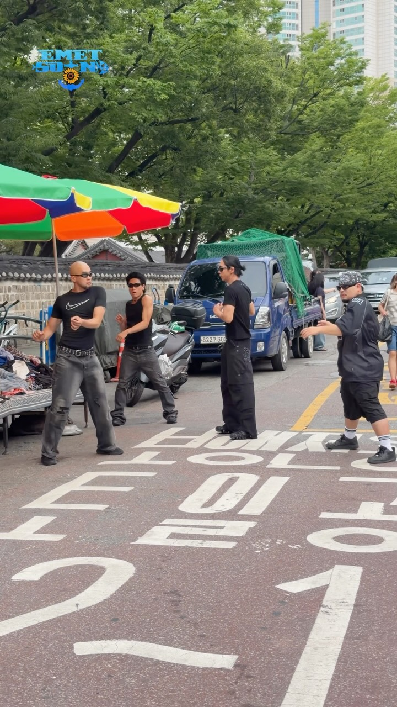 | [원본 챌린지](https://www.instagram.com/reel/DaU4FaVznOi/) | @emetsound | 7/03 | 772만 |
| 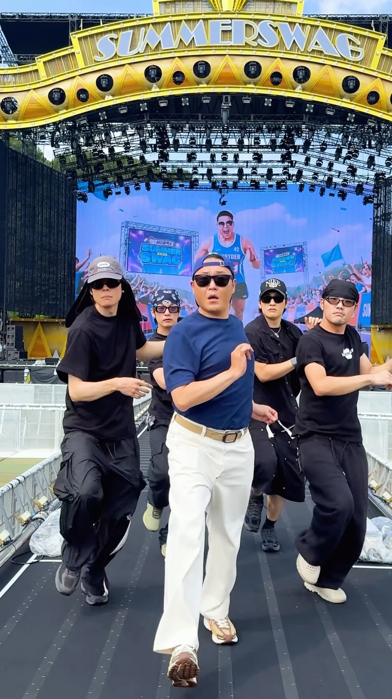 | [싸이 버전 "권력…😎"](https://www.instagram.com/reel/Dbme5ZTR3cr/) | @42psy42 | 8/04 | 789만 |
| 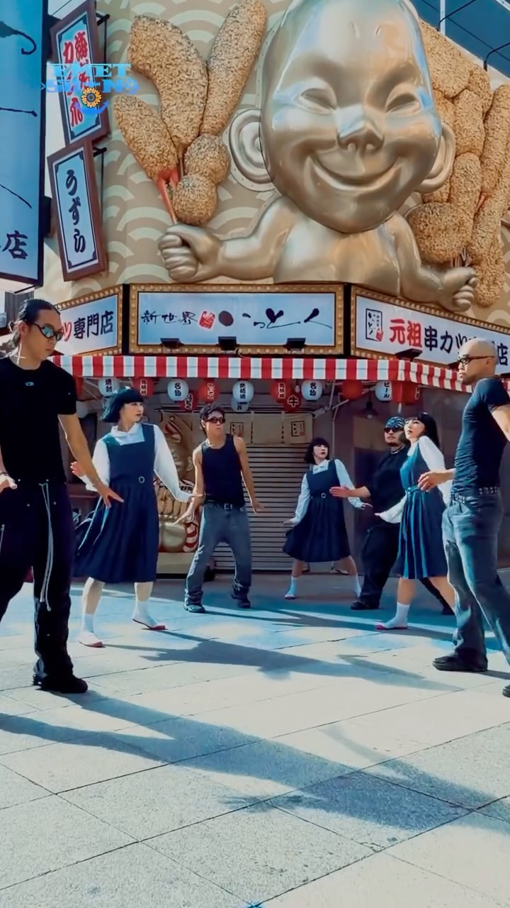 | [일본 아방가르디 콜라보](https://www.instagram.com/reel/Db2n4S3RPFD/) | @emetsound | 8/10 | 401만 |
| 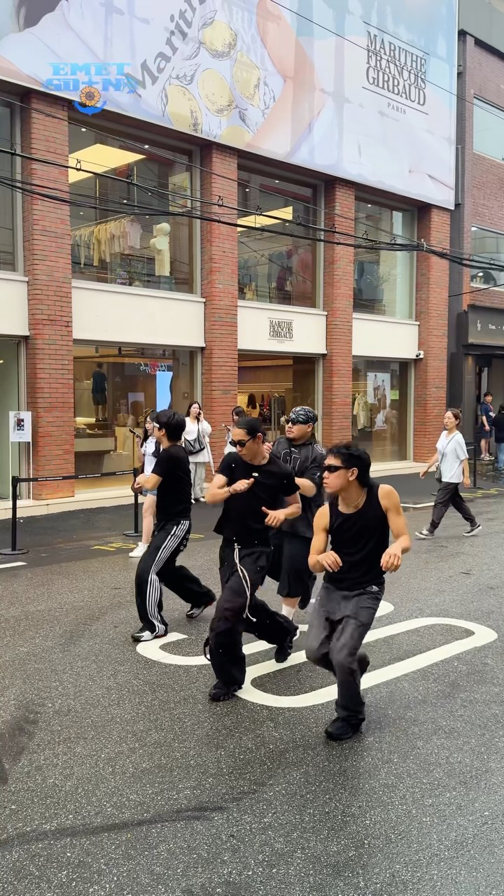 | [춤 이름 공모 영상](https://www.instagram.com/reel/DaaVjlvRkmi/) | @emetsound | 7/05 | 447만 |
| 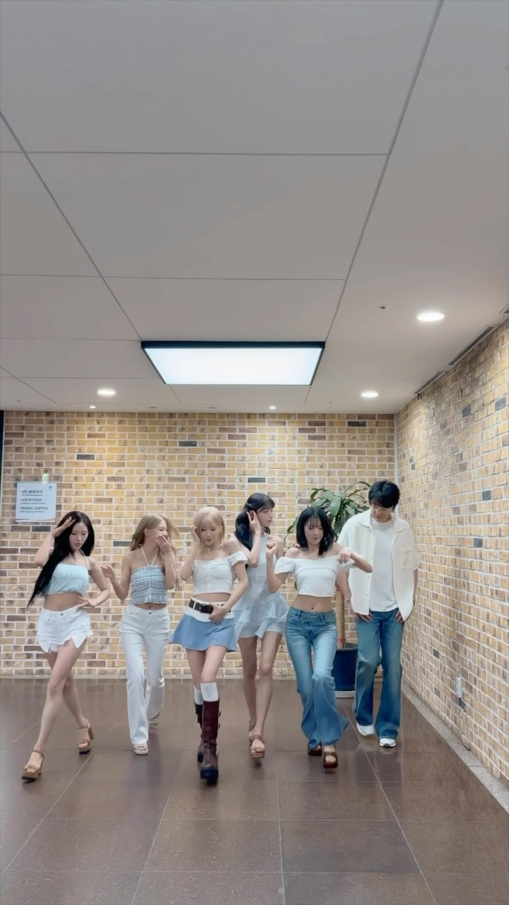 | [프로미스나인 · 더시즌즈](https://www.instagram.com/reel/DbHwcynh4wv/) | @theseasons2023 | 7/23 | 232만 |

### 2. 여름아 부탁해 — 볼빨간사춘기

2002년 곡을 리메이크한 써머송. 공식 계정이 **아이돌을 릴레이로 캐스팅하는 구조**로 굴러가며,
최근에는 원곡 가사 "그대를 가질 수 있다면 드라마도 끊겠어요"를 **자기 버전으로 바꿔 부르는
개사 챌린지로 진화**했습니다. 최예나("말랑이도 끊겠어요"), 최다니엘("담배라도 끊겠어요"),
잔망루피("뽀로로도 끊겠어요") 등이 참여했습니다. 세 챌린지 중 가장 최근까지 살아있습니다.

| 썸네일 | 게시물 | 출연 | 날짜 | 조회수 |
|---|---|---|---|---|
| 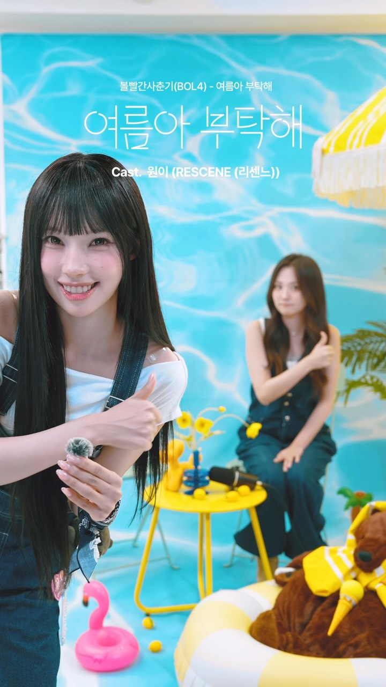 | [리센느 원이](https://www.instagram.com/reel/DbF7jBfzJMO/) | RESCENE | 7/22 | 609만 |
|  | [IVE 리즈](https://www.instagram.com/reel/DbISxTtJrrn/) | IVE | 7/23 | 533만 |
|  | [프로미스나인 송하영](https://www.instagram.com/reel/DcI4FhSTQik/) | fromis_9 | 8/17 | 298만 |
|  | [개사 챌린지 정리](https://www.instagram.com/reel/DcQ0lrwvBA8/) | @sogon.mag | 8/20 | 150만 |

### 3. GG EZ — m.sasuke (안무 @lulu_lunapi)

게임 용어에서 따온 곡으로, **아이돌 퍼포먼스 챌린지**로 자리잡았습니다.
정국(BTS), 투어스 경민, 라이즈 쇼타로, 엔하이픈 선우, 앤더블 규빈, 오마이걸 미미,
ITZY 예지 등이 참여했습니다. 손동작 위주라 따라하기 쉬운 것이 확산 요인입니다.
6~7월에 정점을 찍었습니다.

| 썸네일 | 게시물 | 계정 | 날짜 | 조회수 |
|---|---|---|---|---|
| 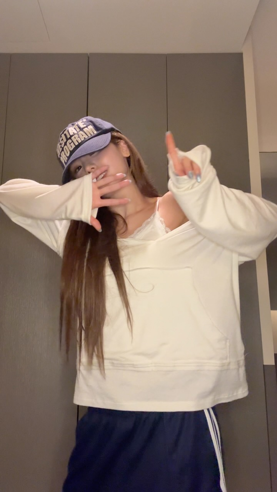 | [ITZY 예지](https://www.instagram.com/reel/DZxSsv1ye_L/) | @itzy.all.in.us | 6/19 | 517만 |
| 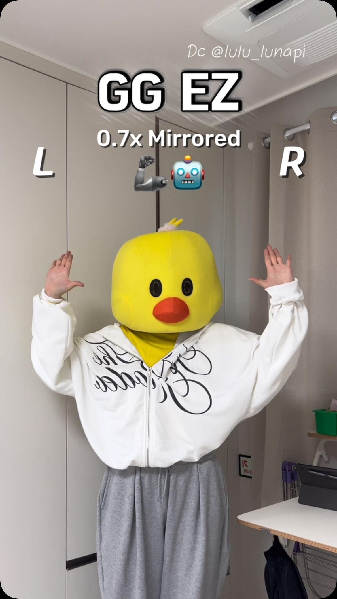 | [손댄스 튜토리얼 (거울모드)](https://www.instagram.com/reel/DaKsN3qzv2L/) | @dancing_____duck | 6/29 | 147만 |
| 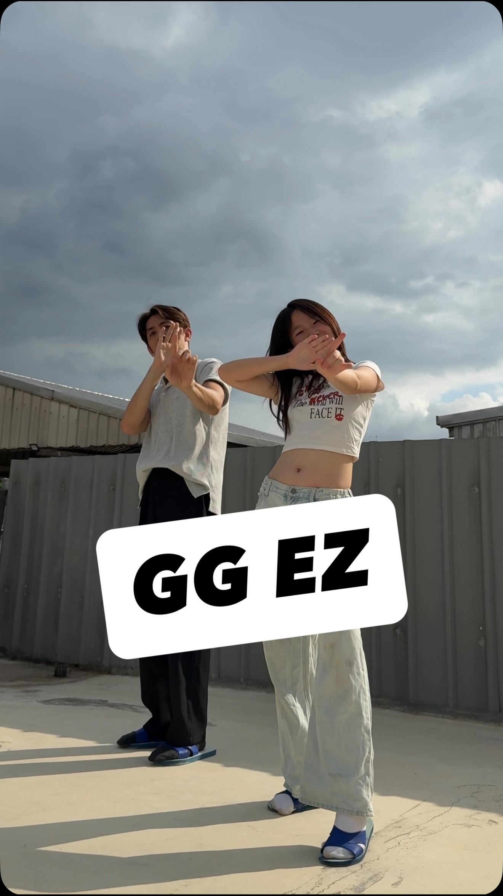 | [전신 버전](https://www.instagram.com/reel/DbKW21vTF_2/) | @baby_aria815 | 7/24 | 123만 |
| 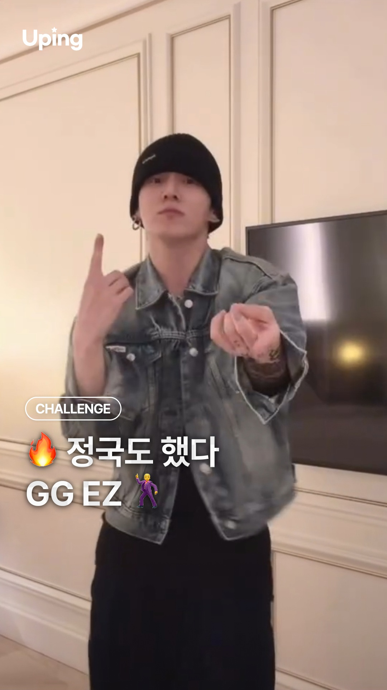 | [정국 합류 정리](https://www.instagram.com/reel/DaBFWPGhGFK/) | @uping_magazine | 6/25 | 18만 |

---

## 그 외 눈여겨볼 만한 것

### DIGIDI DIGIDI (디기디디기디)

댄스 챌린지 중 유일하게 **라인댄스·셔플 쪽으로 퍼져 키즈와 중장년층까지 확산**된 케이스.
발레·유산소 운동 콘텐츠로도 변형되고 있습니다.

| 썸네일 | 게시물 | 계정 | 날짜 | 조회수 |
|---|---|---|---|---|
| 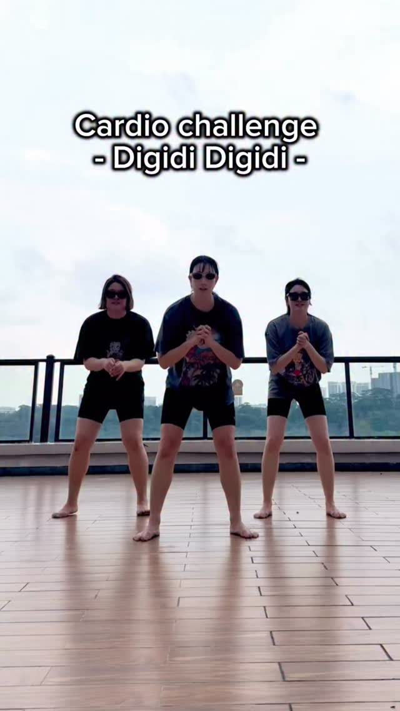 | [전신 유산소 버전](https://www.instagram.com/reel/Da2UuKZzW99/) | @ballet_therafit | 7/16 | 536만 |
| 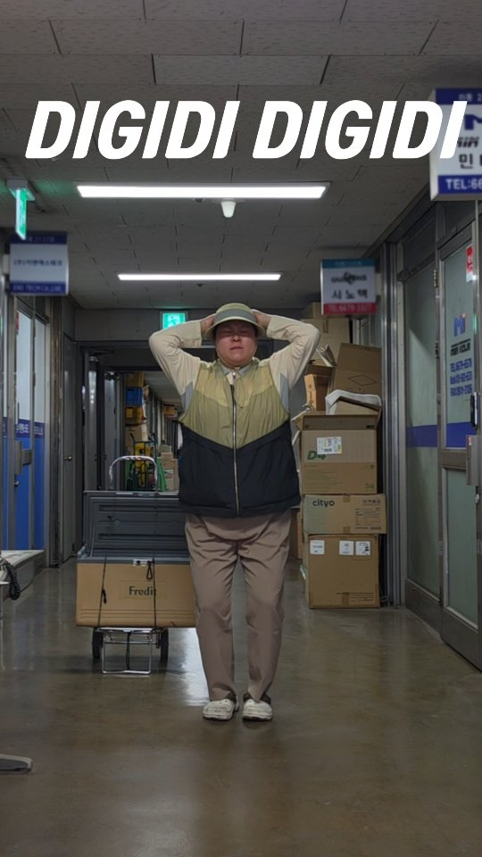 | [대표 영상](https://www.instagram.com/reel/DZLnjN-TYL2/) | @baechuu___ | 6/04 | 186만 |

### 고릴라 챌린지

| 썸네일 | 게시물 | 계정 | 날짜 | 조회수 |
|---|---|---|---|---|
| 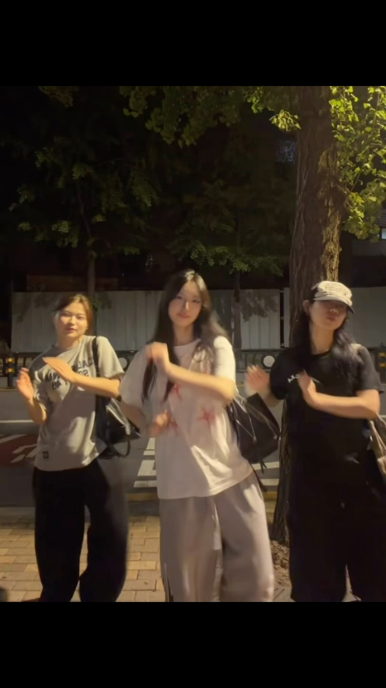 | [김소윤 버전](https://www.instagram.com/reel/Dbv8dERTl_H/) | @sunhyang.an | 8/07 | 259만 |

> 참고: "고릴라 챌린지"로 검색하면 AI로 생성된 춤추는 고릴라 영상, 고릴라 에너지드링크 광고 등
> 다른 맥락의 콘텐츠가 섞여 나옵니다. 순수한 댄스 챌린지로 보기는 어렵습니다.

### Pocket Locket

해외발 트렌드로, 국내 확산은 아직 제한적입니다.

| 썸네일 | 게시물 | 계정 | 날짜 | 조회수 |
|---|---|---|---|---|
| 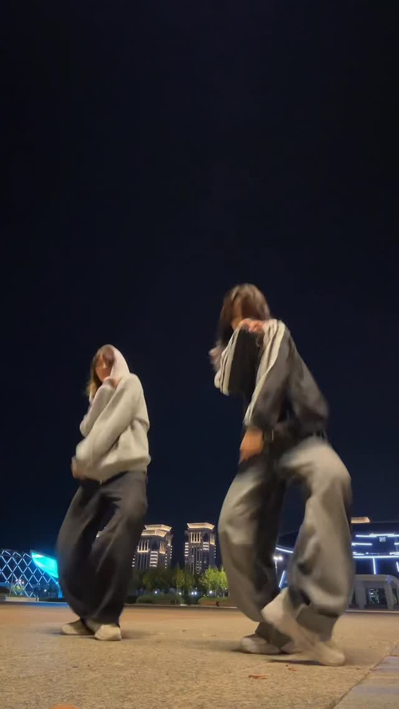 | [대표 영상](https://www.instagram.com/reel/Dbu8k2Puhod/) | @batt_mad | 8/07 | 300만 |

---

## 제외한 항목

**간바레 챌린지 (박지훈)** — 초기 탐색에서 잡혀 확인했으나, **최근 120일 이내 게시물이 0건**이었습니다.
이미 지나간 트렌드로 판단해 제외했습니다.

## 한계

- 인스타그램 웹 검색은 관련도순 정렬이라, 조회수 상위 = 최신 트렌드가 아닐 수 있습니다.
- 수집 표본은 검색 API가 반환한 상위 결과(키워드당 약 18건)로, 전수 조사가 아닙니다.
- 조회수·좋아요는 2026-09-05 기준 스냅샷입니다.
